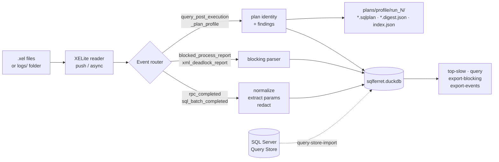

# SQLFerret

**A cross-platform workload analyzer for SQL Server.** Point it at a folder of Extended Events
`.xel` files and it gives you back a self-contained project directory you can query, archive and
share: normalized query shapes ranked by cost, blocking and deadlock digests, real execution plans
deduplicated and triaged, and Query Store snapshots.

No SQL Server Management Studio. No Windows requirement. No server-side agent. One embedded
DuckDB file and a pile of plain JSON.

**In short:**

- **Ingests** Extended Events `.xel` files and normalizes every statement into a fingerprinted
  query shape.
- **Snapshots** Query Store read-only from a live server into the same project.
- **Digests** blocking, deadlocks and real execution plans into ranked, bounded reports.
- **Redacts** parameter values before they touch the disk; obfuscates plans reversibly for sharing.
- **Stores** everything in one queryable DuckDB file — SQL, JSON exports, or an AI agent.

```console
$ sqlferret import ./logs --project ./audits/prod-2026-08
run 1: read=41827 mapped=41120 unmapped=612 cleaned=95 tokenizeFailures=0
       blocking=48 deadlocks=3 blockingParseFailures=0
       planProfiles=346 planParseFailures=0 planWriteFailures=0
plans: 346 profiles, 62 distinct -> ./audits/prod-2026-08/plans/profile/run_1

$ sqlferret top-slow --project ./audits/prod-2026-08 --limit 5
SELECT      1204  total=812304 ms   select o.id , o.total from dbo.Orders o where o.CustomerId = ?
EXEC         318  total=402117 ms   exec dbo.RebuildCart @CartId = ? , @UserId = ?
UPDATE      9822  total=298440 ms   update dbo.Sessions set LastSeen = ? where SessionId = ?
```

---

## Why it exists

An `.xel` capture from a busy production server is a few hundred megabytes of individually
uninteresting events. The interesting object is not the event, it is the **query shape**: the
thousand executions of one statement with different literals, which together account for 40% of
the server's time.

Getting from one to the other normally means SSMS on a Windows box, a
`sys.fn_xe_file_target_read_file` loop, some ad-hoc T-SQL and a spreadsheet. SQLFerret does it in
one command, on any OS, and leaves you with an artifact you can archive and reopen six months
later.

## What it does

| | |
|---|---|
| **Normalizes queries** | Real T-SQL tokenization (ScriptDom, not regex). Literals become `?`, `IN (?, ?, ?)` collapses to `IN (?)`, keywords are lowercased, identifiers keep their casing. The result is SHA-256 fingerprinted, so the same shape always lands on the same row. |
| **Classifies statements** | Each shape carries a `statement_kind`, a `primary_table` and a `target_object`, derived from a real AST — DDL included, so an `ALTER TABLE … ADD` or an index build is a first-class row rather than something you fish out with a regex. |
| **Ranks the workload** | Count, average, p95, max and total duration per query shape, aggregated in DuckDB. Slice by database, login, host or application. |
| **Digests blocking** | Parses `blocked_process_report` into a relational model (wait-resource type, lock mode, isolation level, chain depth) and emits a ranked digest as Markdown or JSON. |
| **Triages real plans** | Ingests `query_post_execution_plan_profile`, deduplicates by plan hash, keeps the first and the slowest `.sqlplan` per distinct plan, and flags spills, oversized memory grants, defeated row goals, cardinality misestimates and large scans. |
| **Imports Query Store** | Read-only snapshot of `sys.query_store_*` into the same project file, with every plan written out as a `.sqlplan`. |
| **Redacts and obfuscates** | Parameter values are redacted before they ever touch the disk. Plans can be obfuscated, with schema/table/column/index names replaced by stable tokens and a reversible map written alongside, so you can share a plan without leaking your data model. |
| **Speaks JSON** | Every export is machine-readable and bounded. The digests exist so that a person, a script or an LLM can read the shape of a 200 MB trace without opening it. |

## How it works



Everything above the storage line is host-agnostic library code (`SqlFerret.Core`). The CLI and
the terminal UI are thin shells over it.

---

## Quick start

### 1. Prerequisites

- [.NET 10 SDK](https://dotnet.microsoft.com/download). That is the only hard requirement.
- Some `.xel` files. If you do not have a capture yet, **[docs/capture-session.md](docs/capture-session.md)**
  has a session script you can paste into SSMS or `sqlcmd`.
- A SQL Server connection *only* for Query Store import and estimated-plan capture. The `.xel`
  analysis path is entirely offline.

### 2. Build

```bash
git clone https://github.com/rudi-bruchez/sqlferret.git
cd sqlferret
dotnet build
```

### 3. Import a capture

```bash
dotnet run --project src/SqlFerret.Cli -- \
    import ./logs --project ./audits/prod-2026-08
```

`--project` points at a **directory**, created on first use. `import` accepts either a single
`.xel` file or a folder, in which case every top-level `*.xel` is read in name order, which is the
order SQL Server numbers its rollover files in.

Add `--redaction off` when the analysis needs the real SQL text and parameter values. It is also
the only policy that retains raw blocking and deadlock XML — see
[docs/privacy.md](docs/privacy.md).

### 4. Look at the workload

```bash
dotnet run --project src/SqlFerret.Cli -- top-slow --project ./audits/prod-2026-08 --limit 20
```

For anything `top-slow` does not cover, run SQL against the project directly:

```bash
dotnet run --project src/SqlFerret.Cli -- query --project ./audits/prod-2026-08 --format md \
    --sql "SELECT statement_kind, count(*) n FROM normalized_queries GROUP BY 1 ORDER BY n DESC"
```

Or open the terminal UI, which gives you a sortable table with drill-down into individual
executions and their parameters:

```bash
dotnet run --project src/SqlFerret.Tui -- ./audits/prod-2026-08
```

Or skip all three and open the store yourself, because it is just DuckDB:

```bash
duckdb ./audits/prod-2026-08/sqlferret.duckdb
```

```sql
SELECT database_name, count(*) AS execs, sum(duration_us) / 1e6 AS total_s
FROM executions
GROUP BY 1
ORDER BY total_s DESC;
```

### 5. Get a blocking digest

```bash
dotnet run --project src/SqlFerret.Cli -- \
    export-blocking --project ./audits/prod-2026-08 --format md --out blocking.md
```

## Commands

| Command | What it does |
|---|---|
| `import <path> --project <dir>` | Ingest a `.xel` file or folder. [→](docs/cli-reference.md#import) |
| `top-slow --project <dir>` | Print query shapes ranked by total duration. [→](docs/cli-reference.md#top-slow) |
| `query --project <dir> --sql <text>` | Run arbitrary SQL against the project, as `table`, `csv`, `json` or `md`. [→](docs/cli-reference.md#query) |
| `reclassify --project <dir>` | Re-run normalization and classification in place, without re-importing. [→](docs/cli-reference.md#reclassify) |
| `export-blocking --project <dir>` | Blocking digest as Markdown, JSON, or an NDJSON dump. [→](docs/cli-reference.md#export-blocking) |
| `export-events --project <dir> --out <dir>` | Raw blocked-process and deadlock XML, one file per event, plus a manifest. [→](docs/cli-reference.md#export-events) |
| `query-store-import --project <dir>` | Snapshot a live database's Query Store. [→](docs/cli-reference.md#query-store-import) |
| `obfuscate-plan …` | Anonymize `.sqlplan` files, reversibly. [→](docs/cli-reference.md#obfuscate-plan) |

There is no `--help`: run the CLI with no argument and it prints its usage line.

Full flags, exit codes and output formats: **[docs/cli-reference.md](docs/cli-reference.md)**.

### Two notes on `query`

- Duration formatting follows the **output column name**. `SELECT duration_us AS duration` gives
  you raw microseconds; keep the `_us` suffix (`AS total_us`) to keep the formatting, or pass
  `--raw` to never get it.
- A **1000-row limit applies by default**; `--limit <n>` changes it, `--no-limit` lifts it.
  Truncation is announced on `stderr`. `csv` and `json` are faithful formats; `table` and `md` are
  presentation formats that render embedded newlines as `\n`.

## What a project directory looks like

```text
audits/prod-2026-08/
├── sqlferret.duckdb          # the workload: executions, query shapes, blocking, plans, Query Store
├── project.json              # provenance: created / last opened / tool version
├── README.md                 # written at creation, so whoever opens this later knows what it is
├── sqlferret.config.json     # optional: display units, redaction policy, connection string
├── .env                      # optional, gitignored: secrets referenced as ${VAR} from the config
├── plans/
│   ├── *.sqlplan             # estimated and Query Store plans
│   └── profile/run_1/        # actual plans from ingestion run 1
│       ├── p_<planhash>.sqlplan
│       ├── p_<planhash>.worst.sqlplan
│       ├── p_<planhash>.digest.json
│       └── index.json        # one entry per distinct plan: cost, timings, finding kinds
└── exports/                  # export packs
```

The directory is self-describing and portable. Zip it, hand it to a colleague, open it a year
later: everything needed to interpret it travels with it.

## Using it from an AI agent

Every export is bounded JSON or Markdown and the project file is plain DuckDB, so an agent can
work a 200 MB trace without ever opening it. The repository ships a skill that teaches one how:

```
.agents/skills/analyzing-xel-workloads/SKILL.md
```

`.agents/skills/` is the cross-runtime location; this repository's `.claude/skills` is a local
junction to it, and is not committed. To use the skill outside this repository, link it into your
runtime's skills directory — for Claude Code:

```bash
# macOS / Linux
ln -s "$PWD/.agents/skills/analyzing-xel-workloads" ~/.claude/skills/analyzing-xel-workloads
```

```powershell
# Windows — a junction needs no elevation, unlike a symbolic link
New-Item -ItemType Junction `
  -Path  "$env:USERPROFILE\.claude\skills\analyzing-xel-workloads" `
  -Target "$PWD\.agents\skills\analyzing-xel-workloads"
```

A link rather than a copy: the skill evolves with the tool, and a copy goes stale.

The skill (written in French) covers the workflow and, more usefully, the traps that produce
confidently wrong answers: microsecond columns read as milliseconds, validating a filter by what
it retains instead of what it excludes, `LIKE` patterns that assume a literal space, the three
incompatible `query_hash` text formats, and `--redaction off` being the only policy that retains
blocking XML. Setup details in
[getting-started.md](docs/getting-started.md#7-optional-driving-sqlferret-from-an-ai-agent).

## A word on privacy

Production traces contain production data. Read **[docs/privacy.md](docs/privacy.md)** before
pointing SQLFerret at anything real. The short version:

- **Parameter values** are redacted at ingestion, before the write. Four policies: `off` (the value
  is never stored), `hash`, `masked` (default), `full`. A parameter whose name contains `password`,
  `token`, `secret` or `email` is always hashed, whatever the policy says.
- **Statement text is stored raw by default.** Redaction covers *extracted parameters*, not the
  statement itself, so a batch with inlined literals keeps those literals — unless you pass
  `--sanitize-sql-text literals` (or set `ingest.sqlTextSanitization`), which collapses literals
  in the stored statement text instead. See [docs/privacy.md](docs/privacy.md).
- **Blocking and deadlock XML** are only retained when redaction is `off`, because that XML embeds
  full input buffers.
- **Plans can be obfuscated** with `obfuscate-plan`, which rewrites every schema, table, column and
  index name to a stable token and writes the reverse map beside the file.
- `.env` is gitignored and secrets are interpolated as `${VAR}`. Nothing is hardcoded, ever.

## Documentation

| | |
|---|---|
| **[Getting started](docs/getting-started.md)** | The full first-run walkthrough. |
| **[Capture session](docs/capture-session.md)** | Which events and actions to capture, and the one action everybody forgets. |
| **[CLI reference](docs/cli-reference.md)** | Every command, flag, output and exit code. |
| **[Terminal UI](docs/tui.md)** | Keys, views, drill-down. |
| **[Configuration](docs/configuration.md)** | `sqlferret.config.json`, `.env`, precedence rules. |
| **[Data model](docs/data-model.md)** | Every DuckDB table, and useful queries to run against them. |
| **[Query normalization](docs/normalization.md)** | How a statement becomes a fingerprint, and what that does and does not guarantee. |
| **[Execution plans](docs/execution-plans.md)** | Plan-profile ingestion, deduplication, the findings catalogue, the digest format. |
| **[Blocking and deadlocks](docs/blocking.md)** | The blocking model and the digest. |
| **[Query Store](docs/query-store.md)** | Snapshot import, schema, version differences. |
| **[Privacy and redaction](docs/privacy.md)** | What lands on disk, and how to control it. |
| **[Architecture](docs/architecture.md)** | Layering, design rules, why there is no DI container. |
| **[Development](docs/development.md)** | Build, test, conventions, known gaps. |
| **[Agent skill](.agents/skills/analyzing-xel-workloads/SKILL.md)** | How an AI agent should drive SQLFerret, and the traps it must avoid. |

## Status

The `.xel` ingestion pipeline, DuckDB storage, workload and blocking analysis, DDL classification,
ad-hoc `query`, real-plan ingestion, Query Store import, plan obfuscation, the CLI and the terminal
UI are implemented and covered by 512 tests. Ten of those are environment-gated and skip cleanly
when no local capture or live server is available, so a fresh clone runs green.

Known gaps are tracked in [docs/development.md](docs/development.md#known-gaps).

## License

MIT. See [LICENSE](LICENSE).
