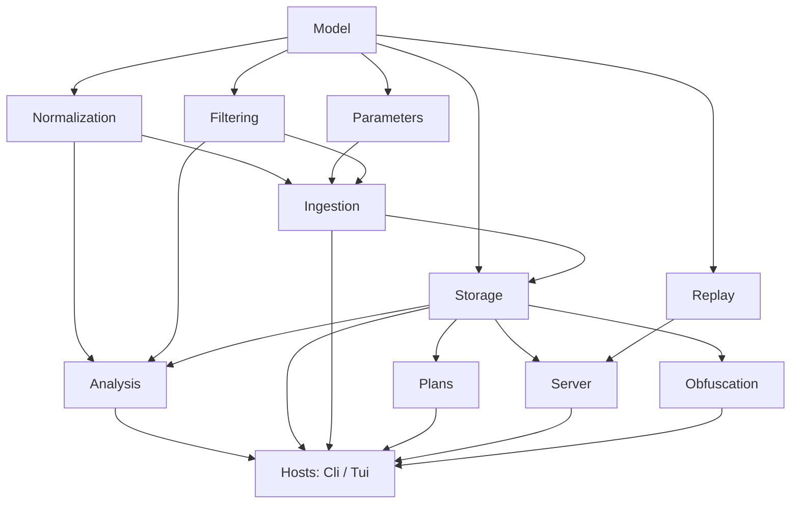
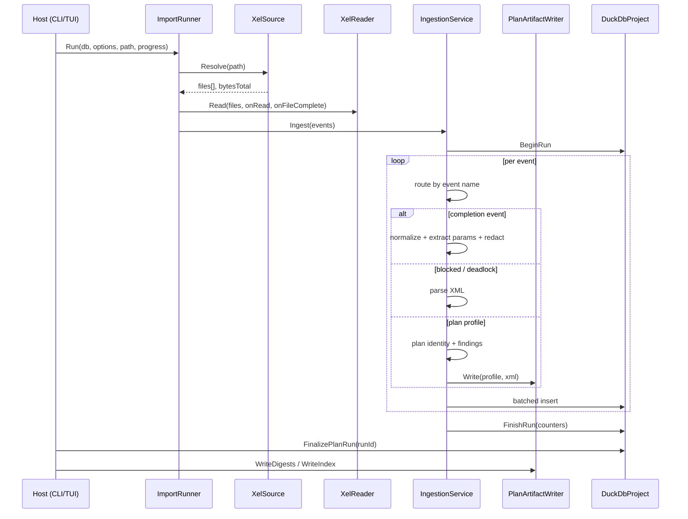

# Architecture

## Shape of the solution

```text
sqlferret.sln                       classic .sln, net10.0 throughout
├── src/
│   ├── SqlFerret.Core/             the entire engine — headless, host-agnostic, testable
│   ├── SqlFerret.Cli/              console host: import, analysis and export commands
│   └── SqlFerret.Tui/              Terminal.Gui host: interactive exploration
└── tests/
    ├── SqlFerret.Core.Tests/       485 tests
    └── SqlFerret.Tui.Tests/        27 tests
```

`SqlFerret.Core` has no reference to either host and no knowledge that a terminal exists. Both
hosts are thin: the CLI is a single `Program.cs` switch statement, and the TUI is presenters over
views. Adding a third host (an HTTP service, an MCP server, a desktop app) means writing a new
shell, not moving logic.

## Layering

Dependencies run one way only:



| Namespace | Responsibility |
|---|---|
| `Model` | Plain records: `ExecutionEvent`, `NormalizedQuery`, `BlockingReport`, `DeadlockReport`, `RawParameter`, `ReplayScript`. No behavior. |
| `Normalization` | ScriptDom tokenization, AST classification, SHA-256 fingerprinting. Pure. |
| `Parameters` | Parameter extraction and the redaction policy. Pure. |
| `Filtering` | `FilterRule` and the compiler that turns rules into a SQL `WHERE` clause or an in-memory predicate. |
| `Ingestion` | XELite reading, event routing and mapping, progress tracking, the `ImportRunner` orchestration entry point. |
| `Storage` | `DuckDbProject`: schema creation, batched inserts, the analysis queries that belong to writing. Split across partial-class files by feature. `Reclassifier` re-runs classification in place. |
| `Analysis` | `WorkloadQueries`, `BlockingQueries`, `BlockingDigest`, `EventExportService`, `AdHocQuery`. All aggregation is SQL. |
| `Plans` | Showplan parsing, plan identity, the findings rules, the artifact writer. |
| `Obfuscation` | Identifier mapping, plan rewriting, statement-text rewriting. |
| `Server` | The only namespace that opens a `SqlConnection`: estimated-plan capture and Query Store import. |
| `Replay` | Reconstructs a runnable T-SQL batch from a captured execution. |
| `Config` | `.env` loading, `sqlferret.config.json`, display formatting, TUI state persistence. |
| `Project` | `AuditProject` and `ProjectManifest`: the project directory as an object. |

## Design rules

These are enforced, not aspirational. A change that violates one should be rejected in review.

### KISS, deliberately

There is no repository pattern, no unit of work, no onion or Clean or DDD layering, no
`IXxxService` interfaces without a second implementation, no AutoMapper, no MediatR, no CQRS, and
no dependency-injection container.

What there is instead: plain `record` and POCO DTOs, static utility classes for pure functions,
and primary-constructor services that take their dependencies as constructor parameters and are
newed up at the call site.

The **only** abstraction in Core is `IXeEventData`, and it earns its place because there are two
genuine implementations: the real XELite event, and the test fakes.

This is a stated preference of the project owner, and the codebase is small and legible as a
direct result.

### Aggregation lives in SQL

Grouping, percentiles and ranking are DuckDB's job. `WorkloadQueries` issues
`GROUP BY … quantile_cont(…) … ORDER BY … LIMIT`; it does not pull rows into C# and reduce them.
DuckDB is an analytics engine and is very good at this. Hand-rolled reduction loops in C# would be
slower, longer, and would need their own tests.

### Microseconds everywhere in Core

Every duration, CPU time and wait time is a `long` count of microseconds, and every column carrying
one is named `*_us`. Conversion to milliseconds or seconds happens exactly once, in the hosts, via
`DisplayFormat`. Core never converts units.

This exists because Extended Events reports `duration` in microseconds, Query Store reports
duration in microseconds, and showplan reports `CompileTime` in milliseconds. Picking one unit and
holding it everywhere is what stops a factor-of-1000 bug from being introduced quietly.

### Nothing is silently dropped

Every event read during ingestion is counted in exactly one bucket on `ingestion_runs`: mapped,
unmapped, cleaned, tokenize-failed, blocking, deadlock, or plan profile, with parse and write
failures counted separately. The counters are mutually exclusive and exhaustive.

You can therefore verify an import arithmetically, and a regression that starts dropping events
shows up as a number that no longer adds up rather than as a quietly smaller result set.

### SQL safety

User-supplied free text — hashes, names, ids, limits, filter values — is passed as a **bound
parameter** (`$name`). Only allow-listed identifiers may be interpolated:

- `FilterCompiler.AllowedFields` gates which columns a filter may reference.
- `WorkloadQueries.SortCols` and `DimFields` gate sort columns and grouping dimensions.
- `FilterCompiler` escapes string values by doubling single quotes.

Path handling has the same discipline: a `planId` destined for a `.sqlplan` file name must be a
bare file-name component, rejected in Core rather than only at the CLI boundary, since Core is
host-agnostic. `--out` paths reject `..` segments.

`SET SHOWPLAN_XML ON` is compile-only. Estimated-plan capture never executes the captured
statement against the target server.

### Redaction happens before the write

`RedactionPolicy` is applied in `IngestionService`, when the `PreparedParameter` is constructed.
An unredacted value never reaches `DuckDbProject`. This is why the policy is a per-run property
recorded on `ingestion_runs` rather than a display-time setting: by the time you can query the
data, the decision has already been made and cannot be undone.

## Data flow through an import



Three things worth noticing:

- **`ImportRunner` is the shared orchestration seam.** Both hosts call it, so the CLI and the TUI
  cannot drift in what an import means.
- **Plan artifacts are streamed, never buffered.** `PlanArtifactWriter` holds two durations per
  plan hash and nothing else. A trace with thousands of plans does not grow memory.
- **The digest pass runs after the ingest**, off aggregated DuckDB rows, which is why per-plan
  minimums, maximums and execution counts are correct even though the writer saw each event once
  and in arrival order.

## Modern C# baseline

`net10.0`, C# 14, `Nullable` and `ImplicitUsings` enabled, `LangVersion` latest.

- Primary constructors for stateful services
- Collection expressions `[]`, not `new[]{}` or `Array.Empty<T>()`
- `record` over tuples for anything with more than two fields
- Raw string literals `"""` for embedded SQL
- `required` / `init` on DTOs
- Pattern matching where it reads better than an if-chain

A bare `catch` is acceptable only on a deliberate fallback path: a parse failure that falls back
to a default, malformed JSON that resets to empty state, a provenance write that must not fail an
otherwise valid open. Those sites carry a comment saying so.

## Extending it

**A new analysis** is a method on `WorkloadQueries` or a new class in `Analysis` that takes a
`DuckDBConnection`. Write the SQL, return a `record`, add a test with an in-memory project.

**A new event type** means a branch in `EventMapper` / `IngestionService`, a counter on
`ingestion_runs`, and storage. The counter is not optional; the exhaustiveness invariant depends
on it.

**A new host** consumes `AuditProject`, `ImportRunner`, `WorkloadQueries` and the digest classes.
`BlockingDigest` in particular returns pure data with no formatting, precisely so that a second
consumer can render it differently.

**A new plan finding** is a private method in `PlanFindings` plus a threshold on
`PlanFindingThresholds`. Both are pure and take an `XDocument`, so they test without any I/O.
